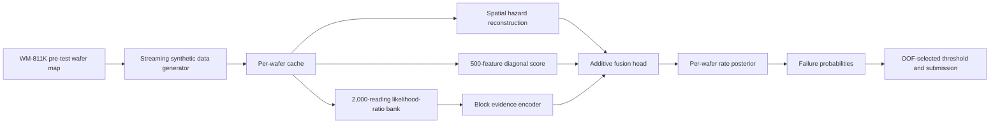
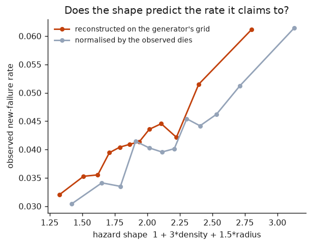
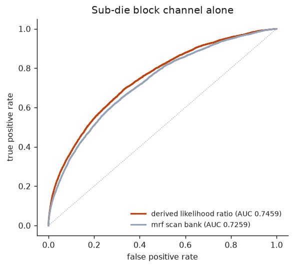
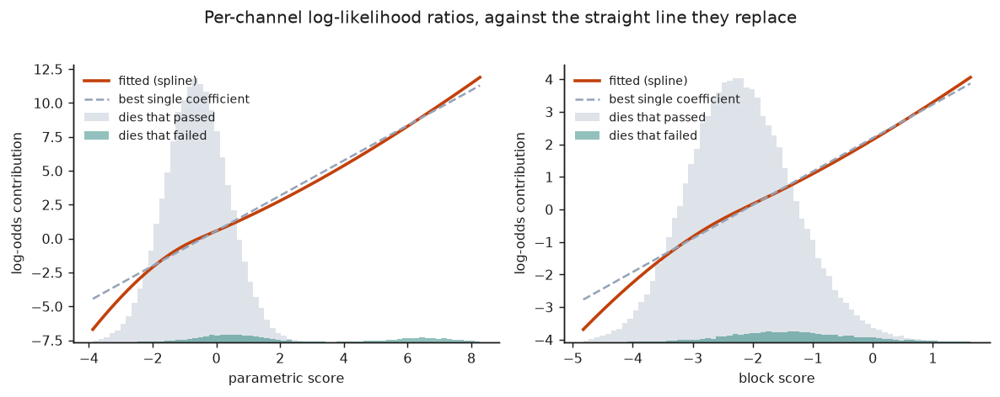
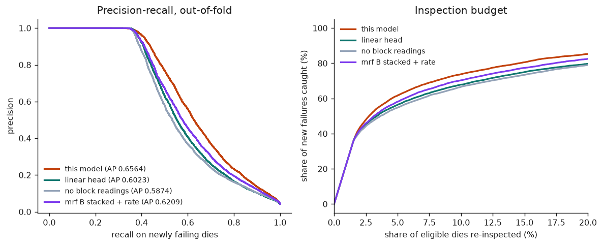
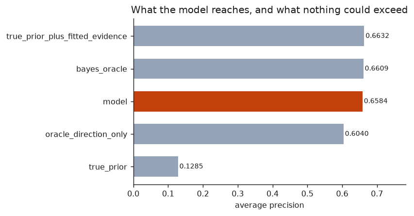
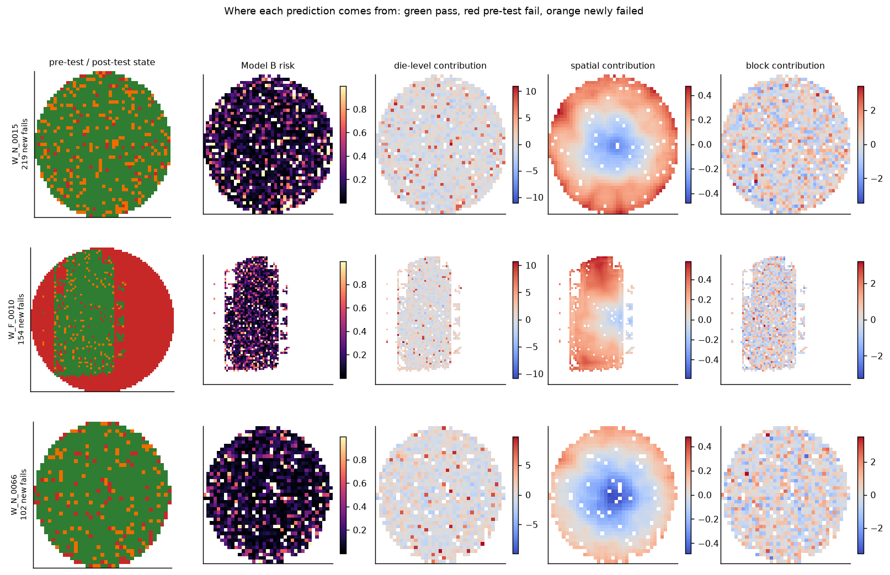
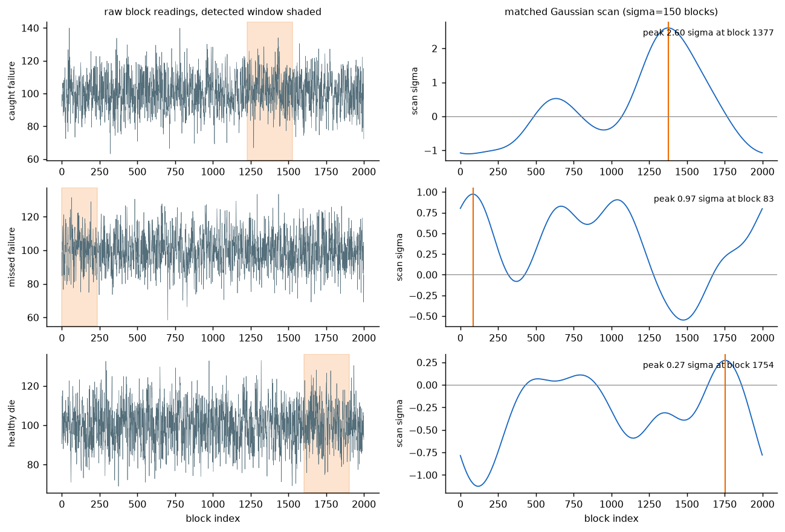

# Multi-Resolution Die Yield Prediction

An interpretable, leakage-aware system for predicting which dies that **passed pre-test** will fail after test. The project fuses three resolutions of information:

| Resolution | Signal | Used by |
|---|---|---|
| Die | 500 parametric measurements per die | Model A and Model B |
| Wafer | Pre-test defect neighbourhood, radial position, edge geometry, and a wafer-specific failure-rate posterior | Model A and Model B |
| Sub-die | 2,000 block-test readings per die | Model B only |

The canonical final implementation is in [`tuned/`](tuned/). The earlier [`modeling/`](modeling/) baseline and [`mrf/`](mrf/) reference pipeline are retained so the final model can be compared fairly against reproducible predecessors.

## Executive summary

The hackathon asks for two probability models:

- **Model A:** die-level measurements plus pre-test spatial context.
- **Model B:** Model A plus high-dimensional block-level readings.

On 160 training wafers, evaluated with 5 wafer-grouped folds repeated 3 times, the final pipeline achieves:

| Final model | Average precision | ROC-AUC | Failure-class F1 |
|---|---:|---:|---:|
| Model A | 0.5874 | 0.8978 | 0.5571 |
| Model B | **0.6564** | **0.9261** | **0.6071** |

On the untouched 40-wafer test split, Model B reaches **0.6597 AP**, **0.9327 ROC-AUC**, and **0.6041 failure F1**. Adding block readings raises held-out AP by **0.0699** over Model A.

The benchmark is intentionally difficult: only 4.23% of eligible dies fail, 65% of generated failures receive only a small parametric shift, and the block signal is a sparse cluster hidden in 2,000 correlated readings. A trivial “all pass” classifier would be about 95.8% accurate, which is why average precision, positive-class F1, precision, and recall are central here.

## Rubric traceability

This section maps the requested deliverables directly to code and saved evidence.

| Rubric area | What this repository provides | Evidence |
|---|---|---|
| Prediction performance — 30% | Side-by-side Model A / Model B AP, ROC-AUC, failure F1, precision, recall, and held-out evaluation | [Results table](RESULTS_TUNED.md), [final holdout summary](results/tuned_final/holdout_summary.csv) |
| Imbalance handling — 20% | Wafer-grouped stratified folds, AP as the lead metric, failure-class F1, out-of-fold threshold selection, and an inspection-budget curve | [validation code](modeling/validation.py), [PR / budget figure](results/tuned_figures/precision_recall.png) |
| Interpretability — 30% | Decomposed spatial prior, parametric evidence score, block evidence score, fitted response curves, rate-recovery diagnostic, and retained per-die visual diagnostics | [fusion model](tuned/pipeline.py), [diagnostic gallery](#interpretability-and-actionable-diagnostics) |
| Multi-resolution fusion and Model A → B analysis — 20% | A controlled Model A / Model B ablation, a likelihood-ratio block detector, and a per-wafer posterior rate model | [experiment catalogue](tuned/experiments.py), [block-channel figure](results/tuned_figures/block_channel.png) |

## Problem framing and target

Each wafer is a grid of dies. A die can already have failed before the prediction point; these are represented by `old_label = 1`. The prediction target is a **new post-test failure among dies with `old_label = 0`**.

| Field | Meaning | Role |
|---|---|---|
| `wafer_id, die_row, die_col` | Wafer and grid location | Grouped validation, spatial reconstruction, submission key |
| `old_label` | Known pre-test failure | Builds spatial context; excluded from scored population |
| `label` | Post-test state in labelled splits | Training/evaluation target |
| `feature_1 … feature_500` | Parametric die measurements | Die-level evidence |
| `block_readings` | 2,000 readings encoded per die | Block-level evidence for Model B |

Pre-test failures are never scored as newly failed dies. In the final pipeline they may be used as additional **known positive examples** when estimating the parametric direction and the block encoder; that is valid because `old_label` is available before inference and those dies carry the same generated failure signature. No post-test label is used to construct spatial features.

## Data and synthetic benchmark

Wafer geometry and pre-test maps come from [WM-811K](https://www.kaggle.com/datasets/qingyi/wm811k-wafer-map). The project then generates a reproducible synthetic multi-resolution benchmark around those maps; this makes the requested target, class imbalance, spatial effects, and block anomalies fully controlled.

The default configuration is [`config.yaml`](config.yaml):

- 160 training wafers and 40 held-out test wafers;
- 500 parametric features per die;
- a 5 × 5 pre-test neighbourhood for the generator’s local-failure density;
- a wafer-specific base failure rate drawn from an exponential distribution;
- 2,000 block readings per die, with a sparse, clustered anomaly for failures;
- 65% marginal failures, whose parametric shift is only 5–25% of the full shift.

For an eligible die `i` on wafer `w`, the generator’s spatial prior is:

```text
h_i = 1 + 3 × local_old_fail_density_i + 1.5 × radial_distance_i
π_i(r_w) = clip(r_w × h_i, 0, 0.4)
```

The streaming generator [`tuned/genstream.py`](tuned/genstream.py) emits the same train/test/validation CSV values as [`generate_data.py`](generate_data.py), while writing one wafer at a time to limit memory use. It also writes generator latents to `input/ground_truth.parquet` strictly for [`tuned/ceiling.py`](tuned/ceiling.py); the predictive model never reads that file.

> **Important:** this is a synthetic benchmark anchored to real wafer-map geometry, not a production fab qualification study. The generator-matched claims and oracle analysis should not be generalized to a real process without external validation.

## Final architecture



### 1. Compact, reproducible feature cache

[`tuned/cache.py`](tuned/cache.py) reads the large CSV one wafer at a time. It:

- reconstructs spatial features only from coordinates and `old_label`;
- keeps the 500 parametric features as `float32`;
- converts each 2,000-value block string into compact block statistics;
- drops the original high-memory strings; and
- writes one Parquet file per wafer.

The block null model — signal level, robust scale, spectrum, and scan normalization — is estimated from the training readings and reused unchanged for test and validation. This keeps block features on the same scale without inspecting test labels.

### 2. Spatial prior: what the wafer knew before test

[`tuned/hazard.py`](tuned/hazard.py) reconstructs the exact grid convention used by the generator. It calculates radial distance on the full wafer-map array, local pre-test failure densities at 3/5/7/11 windows, nearest pre-test failure, edge distance, and wafer-level pre-test failure rate.

The final model starts from the generator-shaped hazard `h_i` and allows a small learned correction to remain robust to reconstruction error. Spatial context is therefore modeled as a **prior**, rather than being confused with evidence from the die’s own measurements.



### 3. Parametric die channel: 500 measurements reduced without losing the generated signal

[`tuned/channels.py`](tuned/channels.py) estimates a diagonal discriminant:

```text
s_i = Σ_f [(μ_fail,f − μ_pass,f) / var_pass,f] × (x_i,f − centre_f)
```

Under this benchmark’s conditional-independence and shared-shift assumptions, this is a sufficient one-dimensional score for the 500 die measurements. The final head does not assume that the score-to-risk relationship is linear: it learns a regularized cubic-spline response, which accommodates the marginal-failure mixture.

The phrase “sufficient” applies to the synthetic generator’s assumptions, not automatically to real manufacturing data. In a real deployment, correlation structure, process drift, and causal validation would need to be re-evaluated.

### 4. Block channel: clustered anomaly detection rather than raw-vector brute force

[`tuned/blocks.py`](tuned/blocks.py) turns the 2,000 block readings into 73 features:

- 64 nonlinear likelihood-ratio scan statistics across whitening levels, anomaly amplitudes, cluster widths, and seed-integration temperatures;
- 9 robust global distribution statistics.

The detector estimates the noise spectrum from readings, whitens the signal, applies a nonlinear density-ratio transform, scans circularly with FFTs, and integrates rather than simply maximizes over unknown cluster location. A ridge logistic model collapses this bank into one `block_score` for the fusion head.



### 5. Additive fusion and per-wafer rate posterior

[`tuned/pipeline.py`](tuned/pipeline.py), [`tuned/head.py`](tuned/head.py), and [`tuned/waferrate.py`](tuned/waferrate.py) implement the final model.

Before integrating over the unknown wafer rate, the evidence is additive in log-odds:

```text
logit(p_i) = logit(π_i) + e_parametric(s_i) + e_block(block_score_i)
```

The prior offset enters the penalized logistic fit with coefficient one. Each evidence channel is represented by a regularized cubic B-spline, so a genuinely near-linear channel remains near-linear while nonlinearity is available when data support it.

The final probability integrates over a posterior for each wafer’s unknown base failure rate:

```text
P(fail_i | wafer) = E_r [ π_i(r) × LR_i / (1 + π_i(r) × (LR_i − 1)) ]
where LR_i = exp(e_parametric + e_block)
```

This posterior uses no labels on the scored wafer. Its exponential prior scale is estimated on training wafers only. That makes wafer-level calibration available on an unlabeled prediction split without shrinking every wafer by one hand-picked constant.



## Validation protocol and imbalance safeguards

The evaluation design is intentional:

1. Only `old_label = 0` dies are included in metrics.
2. All rows from a wafer stay together. The splitter is `StratifiedGroupKFold` over `wafer_id`, so no wafer appears in both train and validation partitions.
3. The headline cross-validation result is 5 folds × 3 repeats = 15 wafer-grouped evaluations.
4. The three final hyperparameters are selected on a separate single 5-fold training-only sweep of 12 candidates: spline penalty, number of spline bases, and block-encoder ridge strength.
5. The decision threshold maximizes failure-class F1 on out-of-fold predictions. The 40 held-out wafers are scored once after selection.
6. Average precision is the principal ranking metric; ROC-AUC, failure precision, failure recall, failure F1, accuracy, and confusion-matrix counts are retained for operating-point context.

The selected final settings are `lam_smooth = 20`, `n_bases = 6`, and `block_C = 0.02`. The validation and metric implementation is shared with the earlier pipelines in [`modeling/validation.py`](modeling/validation.py).



For example, the right-hand panel answers a fab-relevant question that accuracy cannot: if only a fixed percentage of eligible dies can be re-inspected, what fraction of the newly failing dies can be found?

## Results

### Fair cross-validation comparison

All rows below use the seed-42 generated dataset, 160 training wafers, 154,037 eligible dies, 6,519 newly failing dies, and the same wafer-grouped fold/metric code. The `mrf` reference results were regenerated in this repository rather than copied from a prior run.

| Pipeline | Model | AP | ROC-AUC | Failure F1 |
|---|---|---:|---:|---:|
| First baseline | Model A | 0.5137 | 0.8438 | 0.5268 |
| MRF reference | Model A | 0.5524 | 0.8844 | 0.5323 |
| **Final tuned** | **Model A** | **0.5874** | **0.8978** | **0.5571** |
| First baseline | Model B | 0.5758 | 0.8848 | 0.5537 |
| MRF reference | Model B | 0.6209 | 0.9132 | 0.5777 |
| **Final tuned** | **Model B** | **0.6564** | **0.9261** | **0.6071** |

The final Model B improves AP by 0.0690 over final Model A, by 0.0355 over the re-run MRF Model B, and by 0.0806 over the first baseline Model B. Full ablations, thresholds, timings, calibration ratios, and fold metrics are in [`RESULTS_TUNED.md`](RESULTS_TUNED.md) and [`results/tuned/`](results/tuned/).

### Untouched 40-wafer holdout

| Model | AP | ROC-AUC | Failure precision | Failure recall | Failure F1 | Accuracy |
|---|---:|---:|---:|---:|---:|---:|
| Model A | 0.5898 | 0.8996 | 0.7980 | 0.4094 | 0.5412 | 0.9706 |
| **Model B** | **0.6597** | **0.9327** | 0.7546 | **0.5036** | **0.6041** | **0.9721** |

The held-out threshold comes only from training out-of-fold predictions. See [`results/tuned_final/holdout_summary.csv`](results/tuned_final/holdout_summary.csv) for the exact confusion counts and [`results/tuned_final/thresholds.json`](results/tuned_final/thresholds.json) for saved thresholds, options, and recovered rate diagnostics.

### Why the final result is credible

The project includes negative results and a ceiling study instead of treating every plausible change as an improvement:

| Diagnostic | Result | Interpretation |
|---|---:|---|
| Parametric only | 0.5263 AP | The 500 die features contain the dominant individual-die signal. |
| Block only | 0.1596 AP / 0.7454 ROC-AUC | Blocks are weak alone but provide complementary evidence. |
| Model B without rate recovery | 0.6022 AP | Wafer-rate posterior integration contributes materially. |
| Final Model B | 0.6564 AP | Selected calibrated cross-validated model. |
| Bayes-oracle diagnostic | 0.6609 AP | In-sample generator-latent ceiling; not a deployment metric. |

The ceiling analysis uses generator-only latent values exclusively to quantify remaining headroom. On the diagnostic run, the fitted model reaches 0.6584 AP versus 0.6609 AP for the Bayes-oracle configuration. See [`tuned/ceiling.py`](tuned/ceiling.py) and [`results/tuned_ceiling/ceiling.json`](results/tuned_ceiling/ceiling.json).



## Interpretability and actionable diagnostics

The system is designed to explain a prediction at three levels.

| Layer | Per-die explanation | Practical question answered |
|---|---|---|
| Parametric | Signed contributions into the diagonal `parametric_score` and the fitted channel-response curve | Which die measurements pulled this die toward failure? |
| Spatial | Reconstructed local old-failure density, radius, edge/nearest-failure features, corrected hazard, and recovered wafer rate | Is the risk driven by pre-test neighbourhood or wafer context? |
| Block | Highest-scoring likelihood-ratio scan configuration and the encoded `block_score` | Is there a localized sub-die anomaly consistent with a defect cluster? |

`Fusion.score_frame` exposes the parametric score, block score, total evidence, and corrected spatial hazard. The channel-level evidence split is exact by construction. At the 500-feature level, the diagonal projection gives an exact contribution to the **parametric score**; because the final score is passed through a nonlinear spline, that per-feature value should be read as a score driver rather than falsely presented as an additive final-probability contribution.

The repository also retains source-level helpers for visual inspection:

- [`mrf/interpret.py`](mrf/interpret.py) materializes signed per-input contributions, ranks top drivers, and maps any per-die column back onto the wafer grid.
- [`mrf/figures.py`](mrf/figures.py) renders wafer state/risk/contribution maps and raw block-reading traces with detected windows.
- [`tuned/figures.py`](tuned/figures.py) renders the final model’s channel curves, PR/budget curve, hazard calibration, rate recovery, and ceiling.

The next gallery is retained as an implementation-level diagnostic from the reproducible `mrf` reference track. It demonstrates the data-to-explanation surfaces — wafer layers, block windows, and ranked drivers — while the final `tuned` figures above are the authoritative final-model performance figures.

<details>
<summary>Open the spatial and block diagnostic gallery</summary>

<br>



<br><br>



</details>

## Reproduce the final pipeline

### Prerequisites

- Python 3.10 or later
- The [WM-811K `LSWMD.pkl` file](https://www.kaggle.com/datasets/qingyi/wm811k-wafer-map), placed at `data/LSWMD.pkl`

Install dependencies:

```powershell
python -m pip install -r requirements.txt
```

### End-to-end commands

Run these from the repository root:

```powershell
# 1. Generate byte-equivalent synthetic CSVs without holding all wafers in memory
python -m tuned.genstream

# 2. Cache features; reuse the training block null model across later splits
python -m tuned.cache input/train.csv cache_tuned/train
python -m tuned.cache input/test.csv cache_tuned/test --null cache_tuned/train/block_null.json
python -m tuned.cache input/validation.csv cache_tuned/validation --null cache_tuned/train/block_null.json

# 3. Verify implementation invariants
python -m unittest discover -s tests -v

# 4. Select the three final constants using training-only grouped CV
python -m tuned.select cache_tuned/train results/tuned_selection

# 5. Repeated grouped cross-validation and ablations
python -m tuned.experiments cache_tuned/train results/tuned --repeats 3

# 6. Fit on all training wafers, score held-out test and unlabeled validation rows
python -m tuned.final cache_tuned/train cache_tuned/test cache_tuned/validation results/tuned_final

# 7. Build the diagnostic ceiling, figures, and report
python -m tuned.ceiling cache_tuned/train results/tuned_ceiling
python -m tuned.figures cache_tuned/train results results/tuned_figures --mrf-oof results/mrf_rerun/oof_predictions.parquet
python -m tuned.report results --output RESULTS_TUNED.md
```

`validation.csv` is the test split with `label` removed. It is intended for inference-format validation, **not** as a second independent holdout and never as a tuning source.

At the checked main revision, the repository test suite contains 47 unit tests covering spatial leakage, group isolation, cache chunk boundaries, block scans, rate posterior behavior, serialization, attribution identities, generator equivalence, and submission validation.

## Outputs

| Path | Contents |
|---|---|
| `results/tuned/experiment_summary.csv` | Repeated cross-validation metrics for Model A, Model B, and ablations |
| `results/tuned/oof_predictions.parquet` | Out-of-fold probabilities for thresholding and PR diagnostics |
| `results/tuned_final/model_a.joblib` / `model_b.joblib` | Fitted final model bundles and thresholds |
| `results/tuned_final/holdout_summary.csv` | One-time held-out test metrics |
| `results/tuned_final/submission.csv` | `wafer_id, die_row, die_col, predicted_label` for every prediction die |
| `results/tuned_final/thresholds.json` | OOF threshold, tuned options, and per-wafer posterior mean rates |
| `results/tuned_figures/` | Final-model figures used throughout this README |

The submission writer validates uniqueness and schema before output. Dies already failed at pre-test are assigned `predicted_label = 1` directly, because they are known failures rather than predictions.

## Repository map

```text
generate_data.py          Reference synthetic-data generator
config.yaml               Data-generation configuration
modeling/                 Original baseline, common validation, and cache utilities
mrf/                      Interpretable reference pipeline and visual diagnostics
tuned/                    Canonical final generator-matched fusion pipeline
tests/                    47 unit tests across the three pipelines
results/                  Reproducible metrics, models, submissions, and figures
RESULTS_TUNED.md          Generated detailed final experiment report
```

## Reading order

For a short evaluation of the final work:

1. Start with this README’s result and validation sections.
2. Read [`RESULTS_TUNED.md`](RESULTS_TUNED.md) for every ablation and metric.
3. Read [`tuned/pipeline.py`](tuned/pipeline.py) for the end-to-end posterior.
4. Use [`tuned/RUNBOOK.md`](tuned/RUNBOOK.md) to reproduce the final run.

For implementation history and an independently interpretable reference, inspect [`RESULTS.md`](RESULTS.md), [`mrf/`](mrf/), and [`modeling/`](modeling/).
